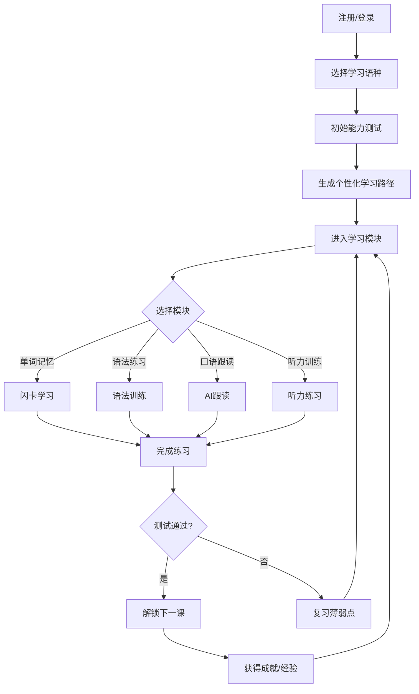
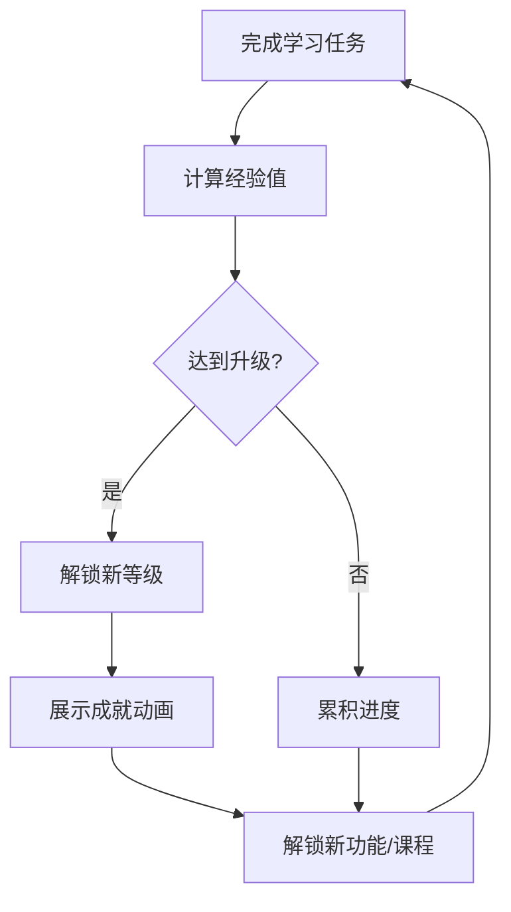

# 多语种在线学习平台 - 产品需求文档

## 1. 产品概述

**LinguaFlow 沉浸式多语种学习平台**是一款面向全球语言学习者的在线教育产品，支持英语、日语、韩语等主流语种的学习。平台通过AI驱动的个性化学习路径、沉浸式互动模块和游戏化成就系统，打造专业且富有吸引力的语言学习体验。

- **核心价值**：让语言学习变得有趣、高效、个性化
- **目标用户**：零基础至中级的语言学习者（15-40岁）
- **市场定位**：中高端在线语言学习市场，区别于传统枯燥的背单词软件

## 2. 核心功能

### 2.1 用户角色

| 角色 | 注册方式 | 核心权限 |
|------|---------|---------|
| 游客 | 无需注册 | 浏览首页、查看公开课程介绍 |
| 注册用户 | 邮箱/手机号注册 | 使用全部学习功能、进度追踪、社区互动 |
| 会员用户 | 付费升级 | 高级课程、AI口语辅导、无限制学习 |

### 2.2 功能模块

1. **首页/仪表盘**：学习概览、今日任务、推荐课程、快速入口
2. **课程中心**：分级课程体系、课程详情、学习进度
3. **学习模块**：
   - 单词记忆（闪卡、拼写测试、联想记忆）
   - 语法练习（填空、改错、场景模拟）
   - 口语跟读（AI评分、波形对比、跟读练习）
   - 听力训练（听写、选择题、听音辨义）
4. **学习追踪**：进度可视化、连续学习天数、数据统计
5. **个人中心**：学习路径推荐、学习设置、成就徽章
6. **社区中心**：学习小组、话题讨论、学习伙伴匹配
7. **登录/注册**：多方式注册登录、忘记密码

### 2.3 页面详情

| 页面名称 | 模块名称 | 功能描述 |
|---------|---------|---------|
| 首页仪表盘 | 今日学习卡片 | 显示今日学习任务、推荐课程、连续学习天数 |
| 首页仪表盘 | 学习概览 | 周学习时长、已学单词数、掌握程度雷达图 |
| 课程中心 | 课程列表 | 按语种、难度、类型筛选的课程卡片 |
| 课程详情 | 课程信息 | 课程介绍、学习目标、大纲目录 |
| 课程详情 | 开始学习 | 进入课程学习页面 |
| 学习页-单词 | 闪卡模块 | 翻转记忆、点击发音、掌握/模糊/忘记状态 |
| 学习页-单词 | 测试模块 | 拼写测试、选择测试、限时挑战 |
| 学习页-语法 | 练习模块 | 填空题、改错题、情景对话 |
| 学习页-口语 | 跟读模块 | 音频播放、跟读录音、AI评分波形对比 |
| 学习页-听力 | 训练模块 | 听写训练、听音选图、连续对话 |
| 进度追踪 | 数据看板 | 学习日历、热力图、进度条、统计图表 |
| 个人中心 | 个人信息 | 头像、昵称、学习偏好设置 |
| 个人中心 | 学习路径 | AI推荐学习路径、学习目标设定 |
| 个人中心 | 成就中心 | 徽章墙、等级系统、排行榜 |
| 社区中心 | 话题广场 | 热门话题、学习日记、问答互助 |
| 社区中心 | 学习小组 | 小组列表、加入小组、小组话题 |
| 登录页 | 登录表单 | 邮箱/手机密码登录 |
| 登录页 | 注册表单 | 邮箱注册、语种选择、兴趣标签 |
| 注册页 | 初始设置 | 选择学习语种、测试分班、学习目标 |

## 3. 核心流程

### 3.1 用户学习流程



### 3.2 成就激励流程



## 4. 用户界面设计

### 4.1 设计风格

**设计理念：沉浸式学院风 + 现代极简**

- **主色调**：
  - 主色：#6366F1（靛蓝紫，代表智慧与专注）
  - 辅助色：#10B981（翡翠绿，代表进步与成长）
  - 强调色：#F59E0B（琥珀金，代表成就与激励）
  - 背景色：#0F172A（深夜蓝）/ #F8FAFC（云白）
  - 文字色：#F1F5F9（主文字）/ #94A3B8（次级文字）

- **按钮风格**：圆角卡片按钮（border-radius: 16px），悬停时微微上浮+阴影扩散

- **字体选择**：
  - 标题：Noto Sans SC（中文）/ Noto Sans JP（日语）/ Noto Sans KR（韩语）
  - 正文：Inter（英文）
  - 数字/统计：Space Grotesk

- **布局风格**：左侧固定导航 + 右侧内容区的仪表盘布局，卡片式内容呈现

- **图标风格**：Lucide Icons，线条清晰，与主题色一致

### 4.2 页面设计概览

| 页面名称 | 模块名称 | UI元素 |
|---------|---------|--------|
| 首页仪表盘 | 欢迎区域 | 渐变背景、用户头像、学习进度环、动态背景粒子 |
| 首页仪表盘 | 今日任务 | 圆角卡片、进度条、任务图标、悬停展开详情 |
| 课程中心 | 课程卡片 | 封面图、语言标识、难度星级、进度条、收藏按钮 |
| 学习页-单词 | 闪卡 | 3D翻转动画、发音按钮、状态标签、掌握度颜色 |
| 学习页-口语 | 跟读界面 | 波形动画、录音按钮、评分星级、AI反馈面板 |
| 进度追踪 | 数据看板 | 环状图、柱状图、热力日历、动画数字计数 |
| 成就中心 | 徽章墙 | 3D徽章展示、未解锁灰度显示、获得动画 |
| 社区中心 | 话题卡片 | 用户头像、发布时间、点赞数、评论数 |

### 4.3 响应式策略

- **桌面优先**：1440px设计基准，最大宽度1920px
- **平板适配**：768px-1024px，导航收起为侧边栏
- **移动适配**：< 768px，底部Tab导航，单列布局
- **触控优化**：按钮最小点击区域48px，滑动手势支持

## 5. 技术架构

### 5.1 技术栈选择

- **前端框架**：React 18 + TypeScript
- **构建工具**：Vite
- **样式方案**：Tailwind CSS
- **动画库**：Framer Motion
- **路由管理**：React Router v6
- **状态管理**：Zustand
- **UI组件**：Headless UI + 自定义组件
- **图标**：Lucide React
- **图表**：Recharts
- **数据模拟**：Mock数据（无后端）

### 5.2 项目结构

```
src/
├── components/          # 可复用组件
│   ├── common/          # 通用组件（按钮、卡片、输入框等）
│   ├── layout/         # 布局组件（导航、侧边栏、页脚）
│   ├── learning/        # 学习模块组件
│   └── community/       # 社区组件
├── pages/              # 页面组件
├── hooks/               # 自定义Hooks
├── stores/              # Zustand状态库
├── data/                # Mock数据
├── styles/              # 全局样式
├── utils/               # 工具函数
└── types/               # TypeScript类型定义
```

## 6. 数据模型

### 6.1 核心数据结构

```typescript
// 用户
interface User {
  id: string;
  email: string;
  nickname: string;
  avatar: string;
  targetLanguage: 'en' | 'ja' | 'ko';
  level: number;
  exp: number;
  streak: number; // 连续学习天数
  joinedAt: Date;
}

// 课程
interface Course {
  id: string;
  language: 'en' | 'ja' | 'ko';
  level: 1 | 2 | 3 | 4 | 5; // CEFR等级
  title: string;
  description: string;
  coverImage: string;
  duration: number; // 分钟
  lessons: Lesson[];
  enrolledCount: number;
}

// 课程章节
interface Lesson {
  id: string;
  title: string;
  type: 'vocabulary' | 'grammar' | 'speaking' | 'listening';
  content: LessonContent;
  completed: boolean;
  expReward: number;
}

// 学习进度
interface Progress {
  userId: string;
  courseId: string;
  lessonId: string;
  status: 'not_started' | 'in_progress' | 'completed';
  score: number;
  completedAt?: Date;
}

// 成就
interface Achievement {
  id: string;
  title: string;
  description: string;
  icon: string;
  type: 'streak' | 'course' | 'level' | 'special';
  requirement: number;
  rewardExp: number;
}
```

## 7. 页面清单

1. **首页仪表盘** (`/`) - 学习概览、今日任务、快捷入口
2. **课程中心** (`/courses`) - 课程列表与筛选
3. **课程详情** (`/courses/:id`) - 课程信息与章节列表
4. **学习页面** (`/learn/:courseId/:lessonId`) - 四种学习模式
5. **进度追踪** (`/progress`) - 学习数据统计
6. **成就中心** (`/achievements`) - 徽章与等级
7. **个人中心** (`/profile`) - 个人信息与设置
8. **社区中心** (`/community`) - 话题与小组
9. **登录页** (`/login`) - 用户登录
10. **注册页** (`/register`) - 新用户注册
