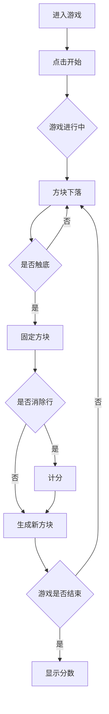

## 1. Product Overview
经典俄罗斯方块游戏的网页版本，支持键盘控制、分数记录和多种游戏模式。
- 提供休闲娱乐体验，经典游戏玩法
- 目标用户：休闲游戏爱好者

## 2. Core Features

### 2.1 Feature Module
1. **游戏主界面**: 游戏画布、分数显示、控制区域
2. **游戏控制**: 键盘方向键控制方块移动和旋转
3. **计分系统**: 消除行数计分，等级提升

### 2.2 Page Details
| Page Name | Module Name | Feature description |
|-----------|-------------|---------------------|
| 游戏页面 | 游戏画布 | 10x20格子的游戏区域，显示方块和已固定的方块 |
| 游戏页面 | 下一个方块预览 | 显示即将出现的下一个方块 |
| 游戏页面 | 分数面板 | 显示当前分数、等级、消除行数 |
| 游戏页面 | 控制按钮 | 开始、暂停、重新开始按钮 |

## 3. Core Process
用户进入游戏页面 -> 点击开始按钮 -> 使用方向键控制方块移动和旋转 -> 方块下落并自动堆叠 -> 消除完整行获得分数 -> 游戏结束显示最终分数

## 4. User Interface Design
### 4.1 Design Style
- 主色调：深蓝色背景配合彩色方块
- 方块颜色：I-青色、O-黄色、T-紫色、S-绿色、Z-红色、J-蓝色、L-橙色
- 按钮样式：圆角矩形，悬停高亮
- 字体：现代无衬线字体
- 布局：左侧游戏画布，右侧信息面板

### 4.2 Page Design Overview
| Page Name | Module Name | UI Elements |
|-----------|-------------|-------------|
| 游戏页面 | 游戏画布 | 300x600像素，网格布局，方块带阴影效果 |
| 游戏页面 | 下一个预览 | 80x80像素，显示即将出现的方块 |
| 游戏页面 | 分数面板 | 白色背景，黑色文字，显示分数、等级、行数 |
| 游戏页面 | 控制按钮 | 灰色背景，点击变色效果 |

### 4.3 Responsiveness
- 桌面优先设计
- 移动端自适应布局
- 支持触摸操作控制

### 4.4 Interaction Design
- 方向键：左/右移动，上键旋转，下键加速下落
- 空格键：直接落到底部
- 游戏结束弹窗：显示分数和重新开始按钮