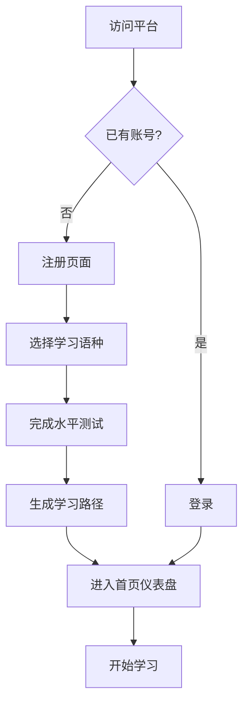
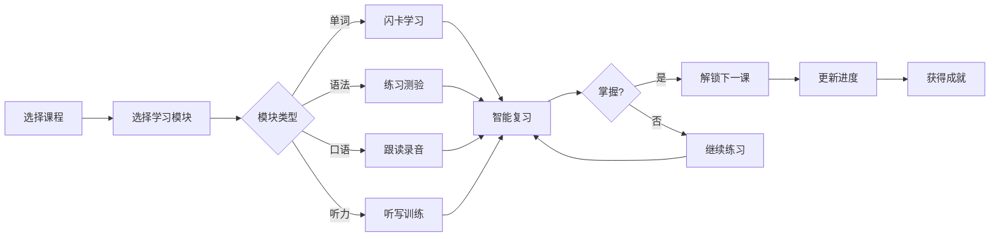
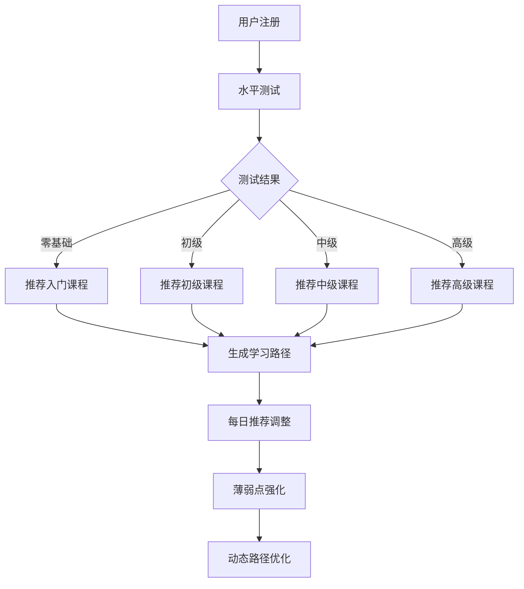

# 多语种在线教育平台 - 产品需求文档 (PRD)

## 1. 产品概述

**LinguaWorld 灵境语言** 是一款沉浸式多语种在线学习平台，支持英语、日语、韩语等主流语言的系统化学习。平台通过AI驱动的个性化学习路径、智能进度追踪、互动式学习模块和成就激励系统，为用户打造专业、高效、有趣的语言学习体验。

### 核心价值
- **沉浸式体验**：模拟真实语言环境，结合视觉、听觉、互动多维度学习
- **个性化路径**：基于用户水平和目标，智能推荐最优学习路径
- **游戏化激励**：成就系统、排行榜、社区互动提升学习动力

### 目标用户
- 语言学习初学者至中高级学习者
- 有出国、留学、商务需求的用户
- 希望提升职场竞争力的在职人员
- 语言爱好者及文化探索者

---

## 2. 核心功能模块

### 2.1 用户角色

| 角色 | 注册方式 | 核心权限 |
|------|----------|----------|
| 游客 | 无需注册 | 浏览首页、体验Demo课程 |
| 注册用户 | 邮箱/手机号注册 | 完整学习功能、进度追踪、社区互动 |
| 付费会员 | 订阅付费 | 高级课程、AI口语教练、离线学习 |

### 2.2 功能模块清单

1. **首页/仪表盘**
   - 学习概览（今日目标、连续学习天数、进度卡）
   - 推荐课程卡片
   - 学习路径可视化
   - 成就徽章展示

2. **课程中心**
   - 语种选择（英语、日语、韩语）
   - 等级分类（零基础→初级→中级→高级→精通）
   - 课程详情页（课程介绍、章节列表、试学入口）
   - 学习进度显示

3. **互动学习模块**
   - 单词记忆（闪卡、拼写测验、智能复习）
   - 语法练习（填空、选择题、错题本）
   - 口语跟读（录音、评分、对比回放）
   - 听力训练（听写、选择、配对）

4. **学习进度**
   - 总体进度仪表盘
   - 各模块完成度
   - 学习时长统计
   - 能力雷达图

5. **个性化推荐**
   - 学习水平测试（入门测试）
   - 智能推荐课程
   - 学习路径规划
   -薄弱点诊断

6. **社区中心**
   - 学习小组
   - 话题讨论区
   - 学习日记/笔记分享
   - 问答互助

7. **成就系统**
   - 徽章收集
   - 等级称号
   - 排行榜（学习时长、正确率、连续天数）
   - 里程碑庆祝动画

8. **用户中心**
   - 个人资料管理
   - 学习设置
   - 消息通知
   - 订阅管理

---

## 3. 核心流程

### 3.1 用户注册登录流程

### 3.2 学习流程

### 3.3 个性化推荐流程

---

## 4. 用户界面设计

### 4.1 设计风格

**设计理念：现代极简 + 活力渐变 + 游戏化元素**

- **主色调**：
  - 主色：#6366F1（靛蓝紫，代表智慧与探索）
  - 次色：#8B5CF6（紫罗兰，代表创造力）
  - 强调色：#F59E0B（琥珀金，代表成就与奖励）
  - 成功色：#10B981（翡翠绿）
  - 背景色：#0F172A（深空蓝）→ #1E293B（渐变）

- **按钮风格**：圆角胶囊形，hover时微光效果，轻微scale动画

- **字体选择**：
  - 标题：Poppins（现代几何感）
  - 正文：Inter（高可读性）
  - 代码/音标：JetBrains Mono

- **布局风格**：
  - 卡片式布局，悬浮阴影
  - 左侧导航栏 + 右侧内容区
  - 响应式设计，适配桌面/平板/手机

- **图标风格**：线性图标 + 填充变体，Lucide Icons

### 4.2 页面设计概览

| 页面名称 | 模块名称 | UI元素与交互 |
|----------|----------|--------------|
| 首页仪表盘 | 学习概览卡片 | 圆形进度环、渐变背景、实时数据 |
| | 今日目标 | 任务清单、完成动画、打卡日历 |
| | 推荐课程 | 横向滚动卡片、语种标识、难度标签 |
| | 成就展示 | 徽章墙、闪光效果、hover放大 |
| 课程中心 | 语种选择 | 大图标网格、hover旋转动画 |
| | 等级标签 | 进度条、当前等级高亮 |
| | 课程卡片 | 封面图、进度条、开始按钮 |
| 学习模块 | 闪卡界面 | 3D翻转动画、左右滑动、发音按钮 |
| | 练习界面 | 答题卡片、即时反馈、连击动画 |
| | 口语界面 | 波形动画、录音按钮、AI评分 |
| | 听力界面 | 音频可视化、进度条、倍速控制 |
| 社区中心 | 帖子列表 | 卡片布局、点赞评论、用户头像 |
| | 发布器 | 富文本编辑器、话题标签 |

### 4.3 响应式策略

- **桌面端 (≥1024px)**：三栏布局，左侧导航 + 主内容 + 侧边栏
- **平板端 (768-1023px)**：双栏布局，折叠导航
- **移动端 (<768px)**：单栏布局，底部Tab导航

### 4.4 微交互动效

- 页面切换：淡入淡出 + 微小位移
- 卡片hover：上浮8px + 阴影加深
- 按钮点击：压缩 → 弹起效果
- 成就解锁：粒子爆炸 + 弹跳动画
- 进度更新：数值滚动 + 环形填充动画

---

## 5. 数据埋点与统计

- 用户行为：页面访问、点击热图、学习时长
- 学习效果：完成率、正确率、复习频率
- 转化漏斗：注册→激活→付费→留存

---

## 6. 性能目标

- 首屏加载 < 2秒
- 页面切换 < 300ms
- 音频加载 < 1秒
- 动画帧率 60fps
- 支持1000+并发用户

