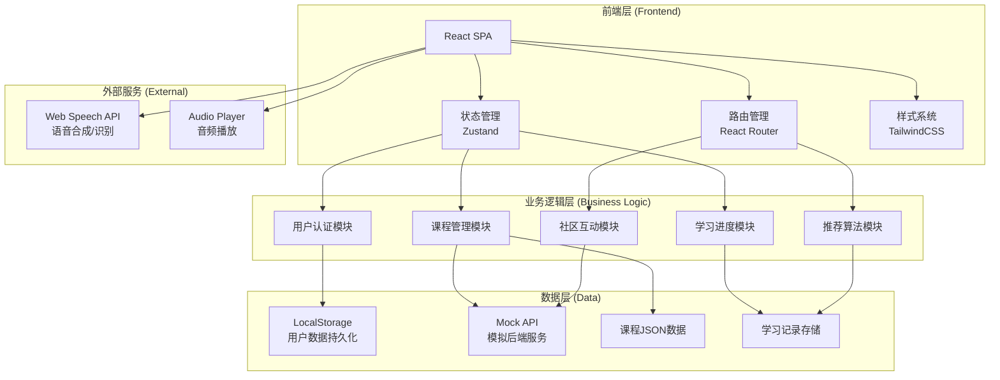
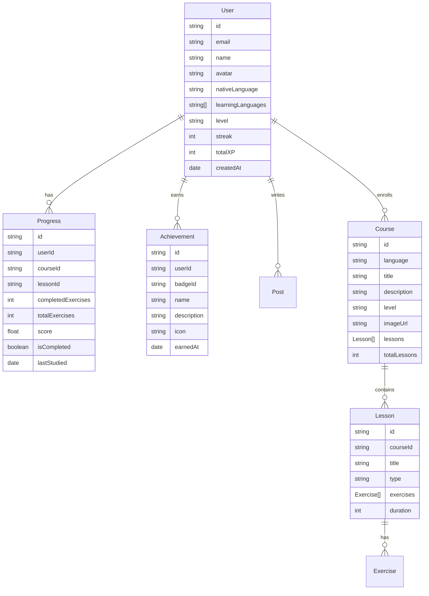

# 多语种在线教育平台 - 技术架构文档

## 1. 架构设计

### 1.1 系统架构图



### 1.2 技术选型

| 技术栈 | 版本 | 用途 |
|--------|------|------|
| React | 18.x | 核心框架 |
| TypeScript | 5.x | 类型安全 |
| Vite | 5.x | 构建工具 |
| TailwindCSS | 3.x | 样式系统 |
| Zustand | 4.x | 状态管理 |
| React Router | 6.x | 路由管理 |
| Framer Motion | 11.x | 动画库 |
| Lucide React | 最新 | 图标库 |
| React Hot Toast | 最新 | 提示组件 |

---

## 2. 路由定义

| 路由路径 | 页面名称 | 描述 |
|----------|----------|------|
| `/` | 首页仪表盘 | 学习概览、推荐课程、成就展示 |
| `/courses` | 课程中心 | 语种选择、等级分类、课程列表 |
| `/courses/:courseId` | 课程详情 | 章节列表、学习进度 |
| `/learn/:lessonId` | 学习模块 | 单词/语法/口语/听力练习 |
| `/progress` | 学习进度 | 进度统计、能力雷达图 |
| `/community` | 社区中心 | 帖子列表、发布功能 |
| `/achievements` | 成就系统 | 徽章墙、排行榜 |
| `/profile` | 个人中心 | 资料管理、设置 |
| `/auth/login` | 登录页 | 用户登录 |
| `/auth/register` | 注册页 | 用户注册 |

---

## 3. 页面组件结构

### 3.1 目录结构

```
src/
├── components/
│   ├── common/          # 通用组件
│   │   ├── Button.tsx
│   │   ├── Card.tsx
│   │   ├── Modal.tsx
│   │   ├── Progress.tsx
│   │   └── Toast.tsx
│   ├── layout/          # 布局组件
│   │   ├── Sidebar.tsx
│   │   ├── Header.tsx
│   │   └── Layout.tsx
│   ├── home/            # 首页组件
│   │   ├── Dashboard.tsx
│   │   ├── TodayGoals.tsx
│   │   ├── CourseCard.tsx
│   │   └── AchievementBadge.tsx
│   ├── courses/         # 课程组件
│   │   ├── LanguageGrid.tsx
│   │   ├── CourseList.tsx
│   │   └── CourseDetail.tsx
│   ├── learning/        # 学习模块组件
│   │   ├── FlashCard.tsx
│   │   ├── GrammarExercise.tsx
│   │   ├── SpeakingCoach.tsx
│   │   └── ListeningTrainer.tsx
│   ├── community/       # 社区组件
│   │   ├── PostList.tsx
│   │   └── PostEditor.tsx
│   └── auth/            # 认证组件
│       ├── LoginForm.tsx
│       └── RegisterForm.tsx
├── pages/               # 页面组件
│   ├── HomePage.tsx
│   ├── CoursesPage.tsx
│   ├── CourseDetailPage.tsx
│   ├── LearningPage.tsx
│   ├── ProgressPage.tsx
│   ├── CommunityPage.tsx
│   ├── AchievementsPage.tsx
│   ├── ProfilePage.tsx
│   ├── LoginPage.tsx
│   └── RegisterPage.tsx
├── stores/              # 状态管理
│   ├── userStore.ts
│   ├── courseStore.ts
│   ├── progressStore.ts
│   └── communityStore.ts
├── hooks/               # 自定义Hooks
│   ├── useAuth.ts
│   ├── useProgress.ts
│   └── useSpeech.ts
├── data/                # Mock数据
│   ├── courses.ts
│   ├── lessons.ts
│   └── achievements.ts
├── utils/               # 工具函数
│   ├── storage.ts
│   └── api.ts
├── styles/              # 全局样式
│   └── index.css
├── App.tsx
└── main.tsx
```

---

## 4. 核心数据模型

### 4.1 数据模型定义



### 4.2 数据存储策略

- **用户数据**：LocalStorage 持久化
- **学习进度**：LocalStorage + 内存状态
- **课程数据**：静态 JSON 文件（Mock数据）
- **社区内容**：LocalStorage 模拟

---

## 5. 核心模块设计

### 5.1 用户认证模块

```typescript
// 认证状态
interface AuthState {
  user: User | null;
  isAuthenticated: boolean;
  isLoading: boolean;
}

// 功能
- 用户注册（邮箱、密码、学习语种选择）
- 用户登录（邮箱、密码）
- 退出登录
- 持久化登录状态
```

### 5.2 课程管理模块

```typescript
// 课程数据结构
interface Course {
  id: string;
  language: 'en' | 'ja' | 'ko';
  title: string;
  description: string;
  level: 'beginner' | 'intermediate' | 'advanced';
  lessons: Lesson[];
  totalLessons: number;
}

// 语种支持
- 英语 (English)
- 日语 (Japanese)  
- 韩语 (Korean)
```

### 5.3 学习进度模块

```typescript
// 进度追踪
interface Progress {
  lessonId: string;
  completed: boolean;
  score: number;
  attempts: number;
  lastAttempt: Date;
}

// 统计指标
- 今日学习时长
- 连续学习天数
- 课程完成率
- 正确率统计
```

### 5.4 推荐算法模块

```typescript
// 推荐策略
- 基于用户等级的课程推荐
- 基于薄弱点的练习推荐
- 基于学习历史的个性化内容
- 每日学习目标推荐
```

### 5.5 成就系统

```typescript
// 徽章类型
- 连续学习徽章（7天、30天、100天）
- 课程完成徽章
- 正确率徽章
- 学习时长徽章
- 社区贡献徽章

// 等级称号
- 初学者 (0-100 XP)
- 学习者 (100-500 XP)
- 进阶者 (500-2000 XP)
- 精通者 (2000-5000 XP)
- 大师 (5000+ XP)
```

---

## 6. 学习模块详细设计

### 6.1 单词记忆模块

- 3D翻转闪卡效果
- 发音朗读功能（Web Speech API）
- 智能复习算法（间隔重复）
- 拼写测验模式

### 6.2 语法练习模块

- 填空练习
- 选择题练习
- 即时反馈系统
- 错题本功能

### 6.3 口语跟读模块

- 录音功能（MediaRecorder API）
- 音频波形可视化
- 播放原音与跟读对比
- 基础评分反馈

### 6.4 听力训练模块

- 音频播放器控制
- 听写练习
- 选择题模式
- 逐句复读功能

---

## 7. 动画与交互规范

### 7.1 页面动画

```css
/* 页面切换动画 */
.page-enter {
  opacity: 0;
  transform: translateY(20px);
}
.page-enter-active {
  opacity: 1;
  transform: translateY(0);
  transition: all 300ms ease-out;
}

/* 卡片悬浮动画 */
.card-hover {
  transition: transform 200ms ease, box-shadow 200ms ease;
}
.card-hover:hover {
  transform: translateY(-8px);
  box-shadow: 0 20px 40px rgba(99, 102, 241, 0.2);
}
```

### 7.2 成就动画

- 徽章解锁：粒子爆炸效果
- 等级提升：全屏庆祝动画
- 连续打卡：火焰动画

---

## 8. 性能优化策略

- React.memo 优化重渲染
- 路由懒加载
- 图片懒加载
- 代码分割
- TailwindCSS JIT模式
- 本地数据缓存

---

## 9. 浏览器兼容性

- Chrome 90+
- Firefox 88+
- Safari 14+
- Edge 90+
- 移动端浏览器（iOS Safari, Chrome Android）

