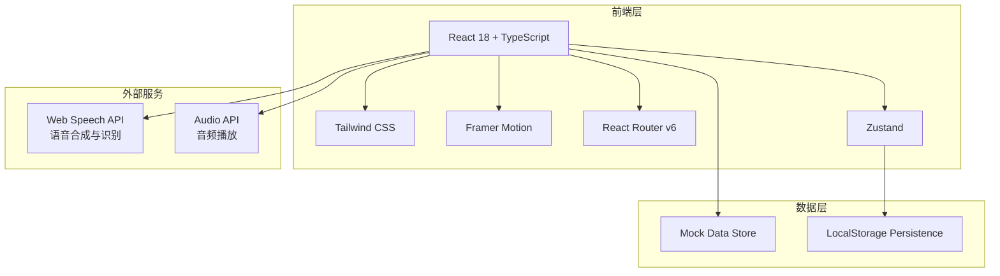
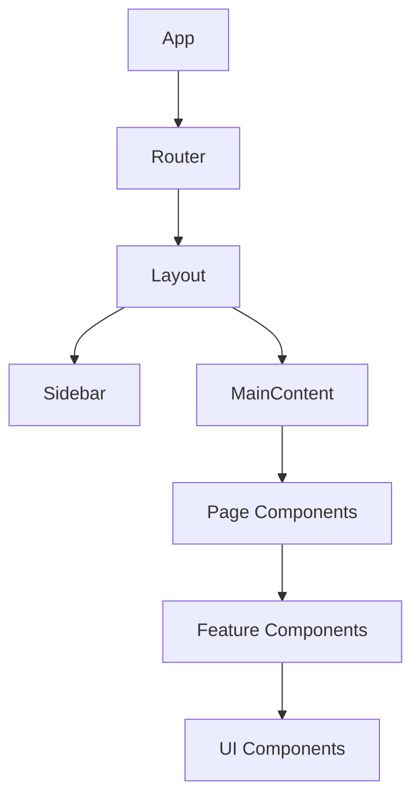

# 多语种在线学习平台 - 技术架构文档

## 1. 架构设计



## 2. 技术选型说明

| 技术 | 版本 | 用途 |
|------|------|------|
| React | 18.x | UI框架 |
| TypeScript | 5.x | 类型安全 |
| Vite | 5.x | 构建工具 |
| Tailwind CSS | 3.x | 样式方案 |
| Framer Motion | 11.x | 动画效果 |
| React Router | 6.x | 路由管理 |
| Zustand | 4.x | 状态管理 |
| Lucide React | 最新 | 图标库 |
| Recharts | 2.x | 图表展示 |

## 3. 路由定义

| 路由 | 页面 | 描述 |
|------|------|------|
| `/` | DashboardPage | 首页仪表盘 |
| `/courses` | CoursesPage | 课程中心 |
| `/courses/:id` | CourseDetailPage | 课程详情 |
| `/learn/:courseId/:lessonId` | LearningPage | 学习页面 |
| `/progress` | ProgressPage | 进度追踪 |
| `/achievements` | AchievementsPage | 成就中心 |
| `/profile` | ProfilePage | 个人中心 |
| `/community` | CommunityPage | 社区中心 |
| `/login` | LoginPage | 登录页 |
| `/register` | RegisterPage | 注册页 |

## 4. 状态管理结构

```typescript
// 用户Store
interface UserStore {
  user: User | null;
  isAuthenticated: boolean;
  login: (email: string, password: string) => Promise<void>;
  register: (data: RegisterData) => Promise<void>;
  logout: () => void;
  updateProfile: (data: Partial<User>) => void;
}

// 课程Store
interface CourseStore {
  courses: Course[];
  currentCourse: Course | null;
  enrolledCourses: string[];
  fetchCourses: () => Promise<void>;
  enrollCourse: (courseId: string) => void;
  getProgress: (courseId: string, lessonId: string) => Progress | null;
}

// 学习Store
interface LearningStore {
  currentLesson: Lesson | null;
  learningMode: 'vocabulary' | 'grammar' | 'speaking' | 'listening';
  sessionStats: LearningSession;
  startLesson: (lesson: Lesson) => void;
  completeLesson: (score: number) => void;
}

// 成就Store
interface AchievementStore {
  achievements: Achievement[];
  userAchievements: string[];
  addAchievement: (id: string) => void;
}
```

## 5. Mock数据结构

### 5.1 用户数据

```typescript
const mockUser: User = {
  id: 'user-001',
  email: 'learner@linguaflow.com',
  nickname: '语言探险家',
  avatar: 'https://api.dicebear.com/7.x/avataaars/svg?seed=learner',
  targetLanguage: 'en',
  level: 5,
  exp: 2450,
  streak: 12,
  joinedAt: new Date('2024-01-15')
};
```

### 5.2 课程数据

```typescript
const mockCourses: Course[] = [
  {
    id: 'course-en-001',
    language: 'en',
    level: 2,
    title: 'English Basic A2',
    description: '日常英语入门，掌握生活常用表达',
    coverImage: '/images/courses/en-basic.jpg',
    duration: 480,
    enrolledCount: 12580,
    lessons: [
      {
        id: 'lesson-en-001',
        title: 'Greetings & Introductions',
        type: 'vocabulary',
        content: { words: [...] },
        completed: true,
        expReward: 50
      }
    ]
  }
];
```

## 6. 组件层级



## 7. 关键实现说明

### 7.1 语音功能
- 使用 Web Speech API 进行语音合成（朗读单词/句子）
- 使用 Web Speech API 进行语音识别（口语跟读评分）
- 降级处理：浏览器不支持时显示提示

### 7.2 数据持久化
- 用户登录状态存储在 LocalStorage
- 学习进度自动保存
- 成就数据本地记录

### 7.3 动画策略
- 页面切换：Framer Motion AnimatePresence
- 组件动画：CSS transitions + Framer Motion variants
- 数据动画：数字计数器动画、进度条动画
