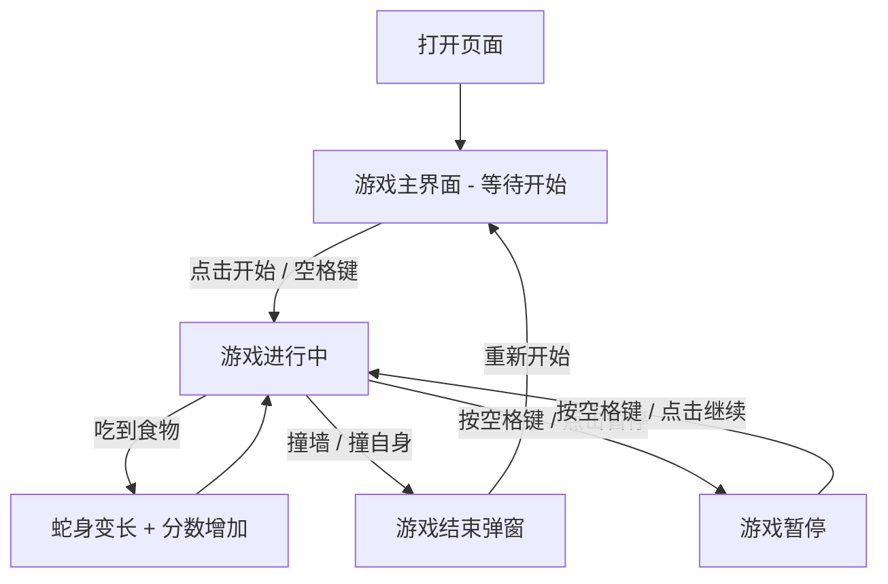

## 1. 产品概述

贪吃蛇经典小游戏——一款以复古像素风为视觉基调的网页版贪吃蛇游戏，让玩家在浏览器中体验经典街机乐趣。
- 目标用户：所有喜欢休闲小游戏的玩家
- 产品价值：提供即时可玩、视觉精美、操作流畅的贪吃蛇游戏体验

## 2. 核心功能

### 2.1 功能模块
1. **游戏主界面**：游戏画布、分数显示、操作提示、开始/暂停/重新开始按钮
2. **游戏结束界面**：最终得分、最高分记录、重新开始按钮

### 2.2 页面详情
| 页面名称 | 模块名称 | 功能描述 |
|----------|----------|----------|
| 游戏主界面 | 游戏画布 | Canvas 绘制的贪吃蛇游戏区域，蛇身、食物、网格背景实时渲染 |
| 游戏主界面 | 分数面板 | 实时显示当前分数与历史最高分 |
| 游戏主界面 | 控制按钮 | 开始、暂停、重新开始按钮，支持键盘方向键与WASD操作 |
| 游戏主界面 | 操作提示 | 显示键盘操作说明 |
| 游戏结束界面 | 结束弹窗 | 显示最终得分、是否刷新最高分、重新开始按钮 |

## 3. 核心流程

玩家打开页面后看到游戏主界面，点击"开始游戏"或按空格键启动游戏。蛇在画布中移动，玩家通过方向键或WASD控制蛇的移动方向。蛇吃到食物后身体变长、分数增加，食物随机重新生成。蛇撞墙或撞到自身则游戏结束，弹出结束弹窗显示得分，可重新开始。

## 4. 用户界面设计

### 4.1 设计风格
- **主色调**：深色背景（#0a0a0a）搭配霓虹绿（#39ff14）作为蛇身颜色，霓虹粉（#ff2e63）作为食物颜色
- **辅助色**：暗灰网格线（#1a1a2e）、霓虹蓝（#00d4ff）用于UI元素高亮
- **按钮风格**：圆角胶囊按钮，霓虹发光边框效果，hover时发光增强
- **字体**：像素风字体 "Press Start 2P" 用于标题和分数，等宽字体用于提示文字
- **布局风格**：居中布局，游戏画布为核心，信息面板环绕
- **动效**：蛇身移动流畅动画、食物脉冲闪烁、吃到食物时粒子爆炸效果、游戏结束屏幕震动

### 4.2 页面设计概览
| 页面名称 | 模块名称 | UI元素 |
|----------|----------|--------|
| 游戏主界面 | 游戏画布 | 深色背景+网格线、霓虹绿蛇身带发光拖尾、霓虹粉食物脉冲闪烁、粒子特效 |
| 游戏主界面 | 分数面板 | 顶部居中，像素字体显示"SCORE"和"BEST"，霓虹蓝数字 |
| 游戏主界面 | 控制按钮 | 画布下方居中，胶囊按钮带霓虹边框 |
| 游戏主界面 | 操作提示 | 底部小字，方向键/WASD图标+文字说明 |
| 游戏结束弹窗 | 结束面板 | 半透明遮罩+居中卡片，显示得分与最高分，重新开始按钮 |

### 4.3 响应式设计
- 桌面优先设计，游戏画布固定尺寸（约480x480）
- 移动端自适应缩放画布，增加虚拟方向键触控区域
- 触控优化：滑动方向控制 + 虚拟方向键按钮
