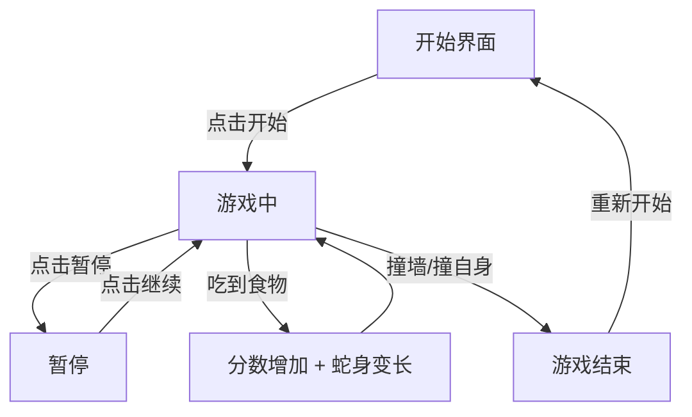

## 1. 产品概述
一款具有复古霓虹美学的现代贪吃蛇游戏，融合经典玩法与视觉冲击力。
- 面向休闲游戏玩家，提供流畅、有趣的贪吃蛇体验
- 以独特的赛博朋克/霓虹视觉风格在同类游戏中脱颖而出

## 2. 核心功能

### 2.1 功能模块
1. **游戏主页面**: 游戏画布、分数显示、操作控制、游戏状态管理

### 2.2 页面详情
| 页面名称 | 模块名称 | 功能描述 |
|----------|----------|----------|
| 游戏主页面 | 游戏画布 | Canvas 渲染蛇身、食物、网格背景，支持方向键/WASD/触屏控制 |
| 游戏主页面 | 分数面板 | 实时显示当前分数、最高分、当前等级 |
| 游戏主页面 | 游戏控制 | 开始/暂停/重新开始按钮，难度选择 |
| 游戏主页面 | 游戏状态 | 开始界面、游戏中、暂停、游戏结束四种状态切换 |
| 游戏主页面 | 特效系统 | 吃到食物的粒子特效、蛇身渐变色彩、网格脉冲动画 |

## 3. 核心流程

玩家进入游戏后看到开始界面，点击开始后蛇开始移动，通过方向键控制蛇的移动方向。蛇吃到食物后身体变长、分数增加，随着分数提升难度逐渐增加（速度加快）。蛇撞到墙壁或自身则游戏结束，显示最终分数和最高分记录。

## 4. 用户界面设计

### 4.1 设计风格
- 主色调：深黑背景 (#0a0a0f) + 霓虹绿 (#00ff88) + 霓虹粉 (#ff0066)
- 辅助色：电光蓝 (#00d4ff)、霓虹紫 (#b400ff)
- 按钮风格：圆角、霓虹发光边框、hover 时光晕增强
- 字体：Orbitron（显示字体，科技感）+ Rajdhani（UI 字体，清晰可读）
- 布局：居中游戏画布，左侧分数面板，右侧控制面板
- 图标风格：线性霓虹风格

### 4.2 页面设计概览
| 页面名称 | 模块名称 | UI 元素 |
|----------|----------|---------|
| 游戏主页面 | 游戏画布 | 深色网格背景、霓虹渐变蛇身、发光食物、粒子特效 |
| 游戏主页面 | 分数面板 | Orbitron 大号数字、霓虹发光效果、最高分记录 |
| 游戏主页面 | 控制面板 | 霓虹边框按钮、难度选择器、移动端方向键 |
| 游戏主页面 | 游戏结束弹窗 | 毛玻璃背景、最终分数、重新开始按钮 |

### 4.3 响应式设计
- 桌面优先设计，画布尺寸自适应
- 移动端：画布缩小，显示虚拟方向键
- 触屏优化：滑动手势控制方向
