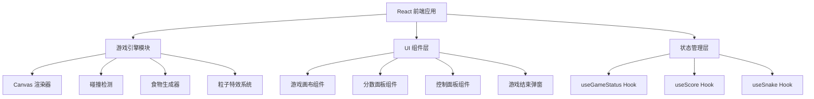

## 1. 架构设计

## 2. 技术说明
- 前端：React@18 + Tailwind CSS@3 + Vite
- 初始化工具：Vite
- 后端：无
- 数据库：无（使用 localStorage 存储最高分）

## 3. 路由定义
| 路由 | 用途 |
|------|------|
| / | 游戏主页面（唯一页面） |

## 4. 核心模块设计

### 4.1 游戏引擎
- 使用 Canvas 2D API 进行渲染
- requestAnimationFrame 驱动游戏循环
- 网格化移动（蛇按格子移动，非像素级）
- 碰撞检测：边界碰撞 + 自身碰撞
- 速度系统：随分数增加逐步加速

### 4.2 状态管理
- 使用 React Hooks (useState, useRef, useCallback, useEffect)
- 游戏状态：idle / playing / paused / gameover
- 蛇的状态：身体坐标数组、移动方向
- 分数状态：当前分数、最高分（localStorage 持久化）

### 4.3 特效系统
- 粒子特效：吃到食物时产生爆炸粒子
- 蛇身渲染：头部到尾部的霓虹渐变色
- 食物渲染：脉冲发光动画
- 网格背景：微弱的脉冲线条动画

### 4.4 控制系统
- 键盘：方向键 / WASD
- 触屏：滑动手势 + 虚拟方向键
- 防止反向移动（蛇不能180度掉头）
