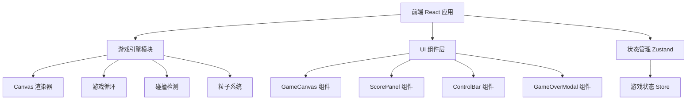

## 1. 架构设计



## 2. 技术说明
- 前端：React@18 + TypeScript + Tailwind CSS + Vite
- 初始化工具：vite-init（react-ts 模板）
- 状态管理：Zustand
- 后端：无
- 数据库：无（最高分存储在 localStorage）

## 3. 路由定义
| 路由 | 用途 |
|------|------|
| / | 游戏主页面（唯一页面） |

## 4. 核心模块设计

### 4.1 游戏引擎（useGameLoop Hook）
- 使用 `requestAnimationFrame` 驱动游戏循环
- 固定时间步长控制蛇的移动速度（初始150ms，随分数递减至80ms）
- 蛇的移动采用网格对齐方式（20x20网格，每格24px）

### 4.2 状态管理（gameStore）
```typescript
interface GameState {
  snake: Point[]
  food: Point
  direction: Direction
  score: number
  bestScore: number
  status: 'idle' | 'playing' | 'paused' | 'gameover'
  speed: number
  particles: Particle[]
}
```

### 4.3 渲染系统
- Canvas 2D 渲染，双层缓冲
- 蛇身：圆角矩形 + 霓虹发光（shadowBlur）
- 食物：脉冲动画圆形 + 外发光
- 网格背景：细线网格
- 粒子效果：吃食物时产生扩散粒子

### 4.4 输入处理
- 键盘：方向键 / WASD 控制方向，空格键暂停/继续
- 触控：滑动手势识别 + 虚拟方向键按钮

## 5. 组件结构
```
src/
├── components/
│   ├── GameCanvas.tsx      # Canvas 游戏画布
│   ├── ScorePanel.tsx      # 分数面板
│   ├── ControlBar.tsx      # 控制按钮栏
│   ├── GameOverModal.tsx   # 游戏结束弹窗
│   └── VirtualDpad.tsx     # 移动端虚拟方向键
├── hooks/
│   ├── useGameLoop.ts      # 游戏主循环
│   └── useInput.ts         # 输入处理
├── store/
│   └── gameStore.ts        # Zustand 状态管理
├── utils/
│   └── gameLogic.ts        # 游戏逻辑（碰撞检测、食物生成等）
├── pages/
│   └── GamePage.tsx        # 游戏主页面
├── App.tsx
└── main.tsx
```
