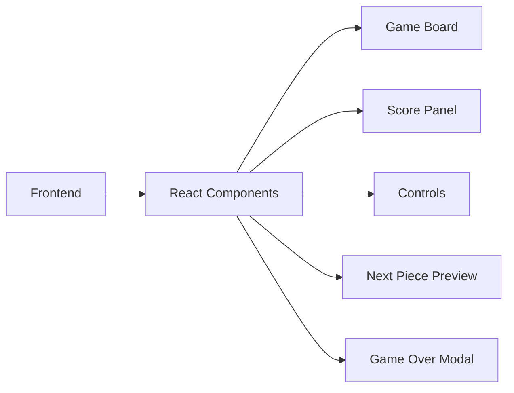

## 1. Architecture Design


## 2. Technology Description
- Frontend: React@18 + tailwindcss@3 + vite
- Initialization Tool: vite-init
- Backend: None (纯前端游戏)
- State Management: React useState/useReducer

## 3. Route Definitions
| Route | Purpose |
|-------|---------|
| / | 游戏主页面 |

## 4. Component Structure
```
src/
  ├── components/
  │   ├── GameBoard.tsx      # 游戏画布组件
  │   ├── ScorePanel.tsx     # 分数面板组件
  │   ├── NextPiece.tsx      # 下一个方块预览
  │   ├── Controls.tsx       # 控制按钮
  │   └── GameOverModal.tsx  # 游戏结束弹窗
  ├── hooks/
  │   └── useGame.ts         # 游戏逻辑hook
  ├── utils/
  │   └── tetrominos.ts      # 方块定义和旋转逻辑
  ├── App.tsx                # 主应用组件
  └── main.tsx               # 入口文件
```

## 5. Data Model
### 5.1 Tetromino Types
| Type | Shape | Color |
|------|-------|-------|
| I | 长条 | #00f5ff |
| O | 方块 | #ffff00 |
| T | T形 | #a855f7 |
| S | S形 | #22c55e |
| Z | Z形 | #ef4444 |
| J | J形 | #3b82f6 |
| L | L形 | #f97316 |

### 5.2 Game State
```typescript
interface GameState {
  board: number[][];           // 10x20的游戏板
  currentPiece: Tetromino;     // 当前方块
  nextPiece: Tetromino;        // 下一个方块
  score: number;               // 当前分数
  lines: number;               // 消除行数
  level: number;               // 当前等级
  gameStatus: 'idle' | 'playing' | 'paused' | 'gameover';
}
```

## 6. Game Logic
### 6.1 移动逻辑
- 左右移动：检测边界和碰撞
- 旋转：旋转矩阵计算，墙踢检测
- 下落：自动下落，加速下落

### 6.2 消除逻辑
- 检测满行
- 消除并计分
- 计算等级提升

### 6.3 计分规则
- 1行：100分
- 2行：300分
- 3行：500分
- 4行：800分
- 等级每10行提升一次，速度增加