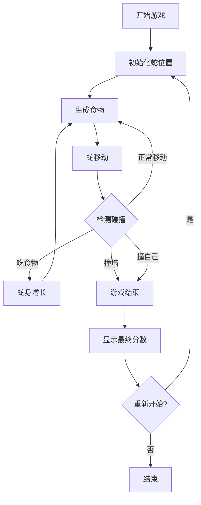

# 贪吃蛇游戏 - 产品需求文档

## 1. 产品概述

一款具有复古街机风格的经典贪吃蛇游戏，采用像素艺术美学和霓虹灯光效果，为玩家带来沉浸式的游戏体验。

- **核心目的**：提供简单上手、富有挑战性的经典游戏体验
- **目标用户**：休闲游戏玩家、怀旧游戏爱好者
- **产品价值**：通过精美的视觉设计和流畅的操控，重现经典游戏的乐趣

## 2. 核心功能

### 2.1 游戏功能模块

1. **游戏画布**：20x20 网格的游戏区域，蛇身和食物的可视化
2. **蛇的移动**：四个方向（上下左右）的连续移动
3. **食物生成**：随机位置生成食物，蛇吃掉后身体增长
4. **碰撞检测**：检测蛇头与墙壁、身体的碰撞
5. **分数系统**：实时显示当前得分和最高分
6. **游戏控制**：开始、暂停、重新开始功能

### 2.2 页面设计

| 页面 | 模块 | 功能描述 |
|------|------|----------|
| 游戏主页 | 游戏画布 | 显示蛇、食物、游戏区域 |
| 游戏主页 | 分数显示 | 当前分数和最高分 |
| 游戏主页 | 控制面板 | 开始/暂停/重新开始按钮 |
| 游戏主页 | 操作说明 | 键盘控制说明 |

## 3. 核心流程

### 3.1 游戏主流程

### 3.2 控制流程

- **方向键/ WASD**：控制蛇的移动方向
- **空格键**：暂停/继续游戏
- **R键**：重新开始游戏

## 4. 用户界面设计

### 4.1 设计风格

- **主题**：复古街机 + 霓虹灯光效果
- **背景**：深色背景配合网格线，营造科技感
- **蛇身**：渐变色方块，带有发光效果
- **食物**：闪烁的圆形，带有脉冲动画
- **整体感觉**：80年代街机厅的怀旧氛围

### 4.2 视觉规格

| 元素 | 颜色 | 样式 |
|------|------|------|
| 背景 | #0a0a1a | 深蓝黑色 |
| 网格线 | #1a1a3a | 细线，透明度20% |
| 蛇头 | #00ff88 | 明亮绿色，带发光 |
| 蛇身 | #00cc66 到 #006633 | 渐变绿色 |
| 食物 | #ff6b6b | 红色，带脉冲动画 |
| 分数文字 | #ffffff | 白色，清晰易读 |
| 边框 | #00ff88 | 霓虹绿边框 |

### 4.3 字体选择

- **标题**：Press Start 2P（像素字体）
- **分数**：VT323（复古终端字体）
- **备用**：monospace

### 4.4 动画效果

- **蛇移动**：平滑过渡
- **吃食物**：缩放弹出效果
- **游戏结束**：闪烁和震动效果
- **食物生成**：淡入 + 脉冲发光

## 5. 技术规格

- **响应式设计**：支持桌面和移动设备
- **键盘控制**：方向键、WASD
- **触摸控制**：屏幕方向按钮（移动端）
- **游戏速度**：初始 150ms，移动速度随分数增加而加快
