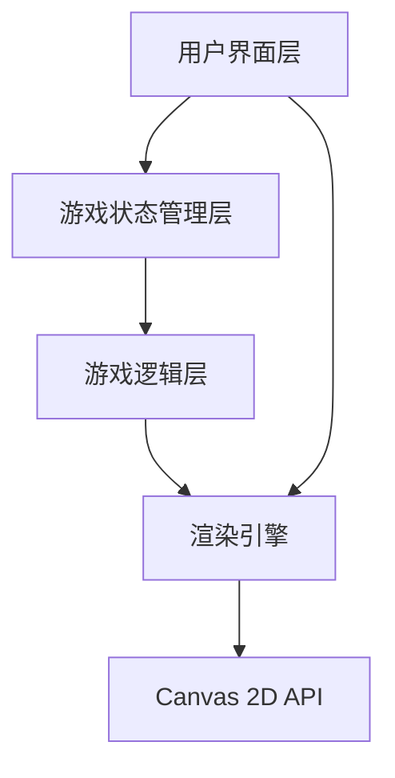

# 贪吃蛇游戏 - 技术架构文档

## 1. 架构设计



### 架构层级

- **用户界面层**：HTML结构、游戏画布、控制按钮、分数显示
- **游戏状态管理层**：游戏状态（运行/暂停/结束）、分数、蛇的位置数据
- **游戏逻辑层**：移动逻辑、碰撞检测、食物生成、增长机制
- **渲染引擎**：Canvas 2D API 绘制游戏画面

## 2. 技术选型

- **前端**：HTML5 + CSS3 + JavaScript（原生）
- **游戏引擎**：Canvas 2D API
- **动画**：CSS Animations + requestAnimationFrame
- **字体**：Google Fonts（Press Start 2P, VT323）
- **存储**：localStorage（最高分持久化）

## 3. 数据结构

### 3.1 游戏状态

```typescript
interface GameState {
  snake: Array<{x: number, y: number}>;  // 蛇身坐标数组
  food: {x: number, y: number};           // 食物坐标
  direction: 'UP' | 'DOWN' | 'LEFT' | 'RIGHT';  // 当前方向
  score: number;                          // 当前分数
  highScore: number;                      // 最高分
  gameStatus: 'IDLE' | 'RUNNING' | 'PAUSED' | 'GAME_OVER';  // 游戏状态
  speed: number;                          // 移动速度(ms)
}
```

### 3.2 游戏常量

```typescript
const GRID_SIZE = 20;        // 网格尺寸
const CELL_SIZE = 25;        // 每个格子大小(px)
const INITIAL_SPEED = 150;   // 初始速度(ms)
const SPEED_INCREMENT = 2;   // 每吃一个食物速度减少(ms)
const MIN_SPEED = 50;        // 最小速度限制
```

## 4. 核心模块

### 4.1 游戏控制器

| 模块 | 职责 | 公共方法 |
|------|------|----------|
| GameController | 游戏主控制器 | init(), start(), pause(), reset(), update() |
| Snake | 蛇的行为逻辑 | move(), grow(), checkCollision() |
| Food | 食物管理 | generate(), checkEaten() |
| Renderer | 渲染引擎 | draw(), drawGrid(), drawSnake(), drawFood() |
| ScoreManager | 分数管理 | addScore(), getHighScore(), saveHighScore() |

### 4.2 事件处理

| 事件 | 处理器 | 功能 |
|------|--------|------|
| keydown | handleKeyPress | 方向控制、暂停、重开 |
| click (按钮) | handleButtonClick | 开始、暂停、重开 |
| touch | handleTouch | 移动端方向控制 |

## 5. 游戏循环

```mermaid
graph循环
    A[requestAnimationFrame] --> B{游戏状态}
    B -->|运行中| C[处理输入]
    C --> D[更新蛇位置]
    D --> E[碰撞检测]
    E -->|吃到食物| F[增长 + 加分 + 加速]
    E -->|撞墙/撞自己| G[游戏结束]
    E -->|正常| H[继续移动]
    F --> I[渲染画面]
    G --> J[显示结束界面]
    H --> I
    I --> A
    J --> K{用户操作}
    K -->|重新开始| A
    K -->|离开| L[结束]
```

## 6. 性能优化

- **双缓冲**：使用 requestAnimationFrame 确保流畅渲染
- **脏矩形渲染**：只重绘变化区域（可选优化）
- **事件节流**：键盘输入防抖处理
- **对象池**：复用蛇身方块对象

## 7. 文件结构

```
/workspace
├── index.html          # 游戏主页
├── styles.css          # 样式文件
├── game.js             # 游戏逻辑
└── .trae/documents/
    ├── 贪吃蛇PRD.md     # 产品需求文档
    └── 贪吃蛇技术架构.md # 本文档
```

## 8. 浏览器兼容

- Chrome 80+
- Firefox 75+
- Safari 13+
- Edge 80+
- 移动端浏览器（iOS Safari, Chrome Android）
